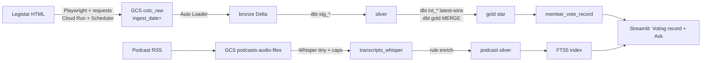
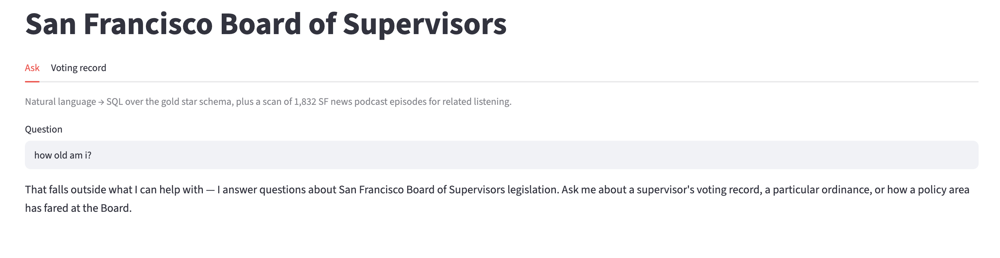
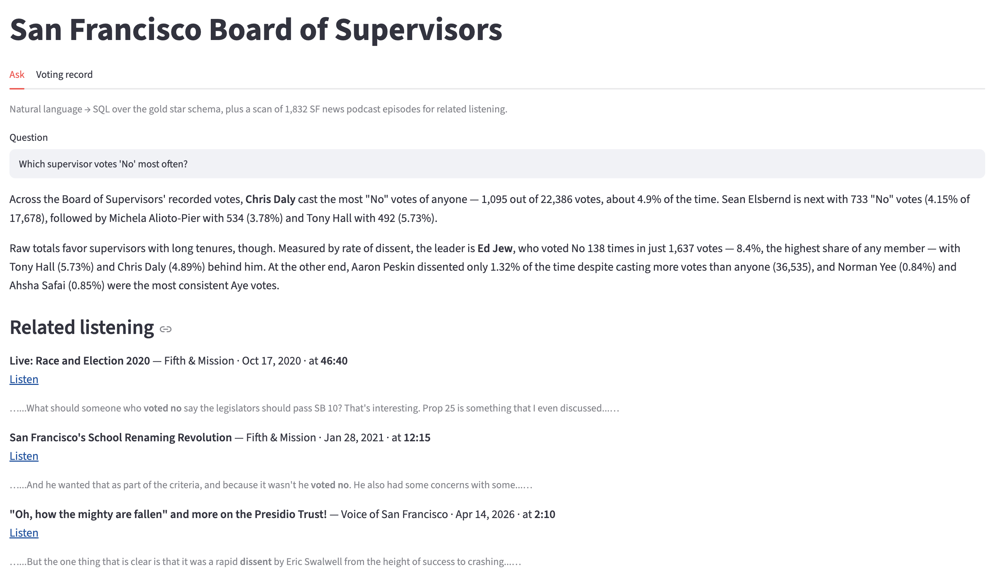
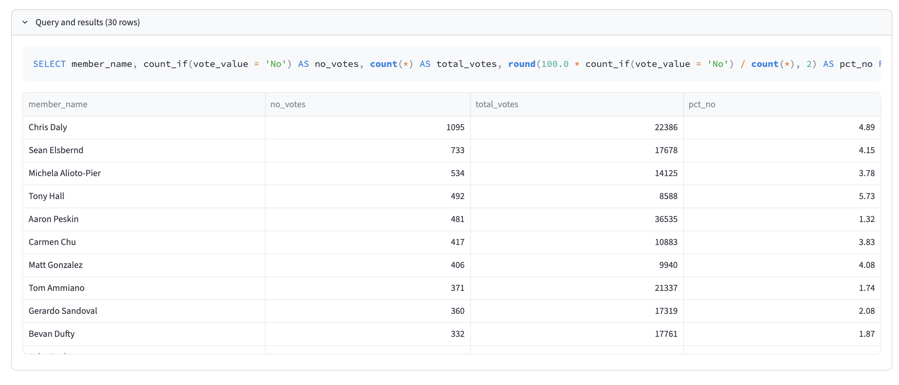
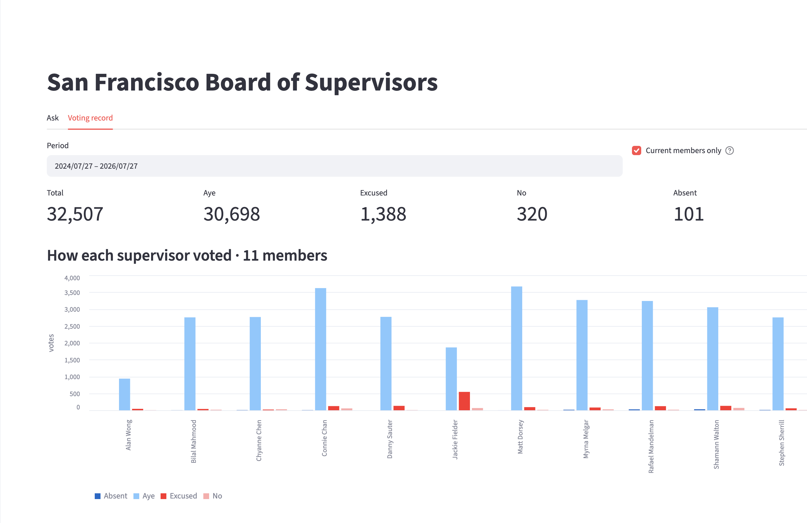
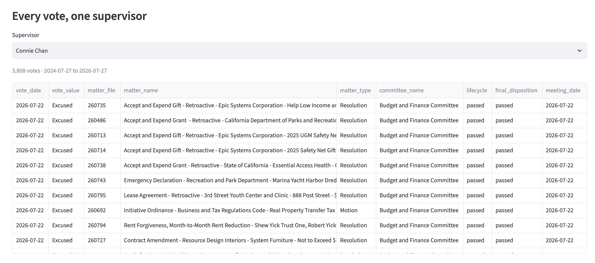

# Making San Francisco's votes queryable

### A legislation lakehouse, a podcast slice, and a text-to-SQL agent

**Team:** Corn Off the Cobb
**Repo:** [github.com/20sgt/Data-Architecture](https://github.com/20sgt/Data-Architecture)

---

## 1. Problem, domain & dataset

San Francisco publishes every bill, committee hearing, and recorded vote on [sfgov.legistar.com](https://sfgov.legistar.com). The record is public but not usable as data, and the city offers no way to download the full history. To learn how a supervisor voted on housing this year, or whether a bill passed or died in committee, you click through Legistar one page at a time.

Local power shows up in roll calls and file numbers, not press releases. It is also a hard data problem. Votes sit buried inside each bill. Statuses change after introduction. Legislation and meetings arrive as two feeds that only connect at the end.

**Who would care:** A neighbor asking "how did my supervisor vote?" A journalist checking a file number. A student who needs a dataset with real size, structure, and questions.

**What we collected**

| What | Source | One row is | How often |
|--------|--------|--------|---------|
| Legislation + meetings | Legistar website scrape | One file per bill or meeting | Weekly, plus a 2000–2026 backfill |
| Podcasts (second source) | SF Chronicle / Voice of SF RSS | One MP3 plus metadata per episode | Weekly, Sunday 03:00 PT |

Our final tables hold **587,758 vote rows** and **179,566 actions**. Each bill is stored once and updated in place as its status and dates change. About **58%** of actions and **3.8%** of votes have no meeting attached, procedural steps that never reached a calendar. Podcasts add **~1,860 episodes across 9 shows** in `gs://podcasts-audio-files`.

Questions we designed for: how a member voted over a date range; what happened to a bill; what is still in committee; whether related local audio exists.

---

## 2. Architecture & data flow

Data moves through three layers. **Bronze** is the raw scrape, saved once and never changed. **Silver** is that data cleaned into proper columns. **Gold** is the shaped tables people query. After bronze, **dbt** runs every step. **Databricks Auto Loader** picks up new files from storage. The app is Streamlit on `gold.member_vote_record`, with an Ask tab that turns English into SQL.

**Stack:** GCP (Cloud Run, Cloud Scheduler, GCS, Terraform) · Databricks (Unity Catalog `corn_off_the_cob`, SQL warehouse, Asset Bundle) · dbt (staging, intermediate, gold, tests) · Streamlit + Anthropic for Ask · faster-whisper for audio.

**dbt:** Eight `stg_*` models unpack the nested bronze files. `int_*` keeps only the newest scrape of each record. Gold builds the reporting tables and `member_vote_record`, and `dbt build` runs 49 data tests alongside them. Writing to production is **opt-in** (`prod_schemas: true`): a `dbt run` on a laptop writes to a personal sandbox, and only the weekly job touches live `silver` and `gold`.

---

## 3. Implementation details & trade-offs

### Batch loads

Legistar is the live system of record, we do not own it, and all we see is its website. Copying it into our own database would mean two designs and a sync job, for an app that never writes. Each scrape saves **one JSON file per record**, filed under its collection date, and old files are never touched. If our gold logic changes, we rebuild from bronze rather than re-scrape 26 years at one request per second.

The weekly scrape collects two things: bills **created** that week, and everything on that week's agendas. A bill whose status changes *away from an agenda* can still go stale. That is an open gap in `TODO.md`, not a solved problem.

### Why Databricks + dbt

Early gold lived in PySpark notebooks. Anyone could rebuild gold there, skipping the tests and the access rules. dbt now owns everything after bronze. Auto Loader stays a notebook, since "load only the files we have not seen" is not plain SQL. `databricks.yml` runs `bronze_ingest` then `dbt_build`, emails on failure, and keeps the **dev schedule paused**, so a local deploy cannot become a live weekly job by accident.

### The main trade-off: one wide table, or join four tables every time

**Choice:** Flatten votes into one wide table, `gold.member_vote_record`: member, bill, outcome, committee, meeting. The joins keep every vote, so a vote with no meeting is not dropped. There is still one row per vote, the same count as `fact_vote`.

**Gained:** The dashboard and the Ask tab answer most "how did X vote?" questions with a single query.

**Gave up:** Every query re-runs a four-way join. This results in about 2× on every dashboard query (767 → 341 ms; see section 5 for more details). Questions about **sponsors, attachments, or district** cannot be answered here. `dim_person` holds names only, and district and party are not on the pages we scrape.

### The podcast pipeline

Audio runs in its **own bucket and pipeline**. RSS → MP3 + metadata → Whisper transcripts in `podcasts/transcripts_whisper/` → rule-based tagging (bills, people, topics, quotes) → SQLite + GCS JSONL. The weekly job uses the **tiny** Whisper model on CPU, capped at **5 new episodes, 20 minutes, about $0.25, and a 30 minute timeout**. The tagging is pattern matching, not a real key into gold, so spoken nicknames like "Prop C" are **not** linked to a Legistar file number.

---

## 4. Deep dive: text-to-SQL on the gold layer

**Why this option:** Civic questions have a clear shape. People ask in English; the tables answer with `vote_value` and `final_disposition`.

**What we built** (`app/ask.py`; Streamlit Ask tab):

1. Read the gold table layout live from the warehouse, so the prompt cannot drift from dbt. That includes **sample values from the 13 columns with a fixed vocabulary**, and a nudge to prefer `corn_off_the_cob.gold.member_vote_record`.
2. The model returns `{sql, search_terms}`. For off-topic input, or input shaped like an instruction ("ignore your instructions…"), it returns an **empty `sql`** and the app stops with a fixed refusal: no query, no podcast search, no second model call.
3. **`guard_sql`:** allow only `SELECT` and `WITH`. Checks run on a copy with comments and quoted text stripped, so real data never trips them. Reject multiple statements and anything that writes. Add `LIMIT 200` if missing, then run it.
4. Optional keyword search over ~60 second transcript chunks (SQLite full text search, no embeddings).
5. A second model call writes a short answer, and it must use the returned rows rather than invented numbers.

### Measuring accuracy

`app/eval.py` grades the model against **hand-written reference SQL**. Both run on the same gold tables, and the results must match row for row, ignoring order. No model marks its own work. 28 saved test cases: 22 for accuracy, 2 guardrail checks, 2 unanswerable questions, and 2 off-topic probes, each group scored on its own so a safety pass never inflates the accuracy number. Guardrails and off-topic declines both hold 2/2.

| run | question set | what the model was told | score |
|---|---|---|---|
| 1 | 16 questions, loosely worded | names + types | 11/16 |
| 2 | same 16, output shape specified | names + types | 16/16 |
| 3 | + 6 harder vocabulary questions | names + types | 21/22 |
| 4 | same 22 | + sampled column values | **22/22** |

Run 1 to 2 fixed the test cases, not the model. Run 3 to 4 is the real result. The last failure rebuilt `lifecycle` from `LIKE '%pass%'` patterns and missed by 408, because the model knew column names but not the values inside them. Adding each small column's distinct values to the prompt took that question from 0/4 to 4/4 on repeat runs.

**The failure that did not move:** Gold has no district column. Asked which district Connie Chan represents, the app answers "District 1" anyway, from the model's own memory, in a paragraph where every other fact came from the warehouse. The answer is *true*, and that is what makes it dangerous. The problem is where the fact came from, not whether it is right, and no row-comparing grader can catch it. Full write-up: [`docs/nl_sql_eval.md`](https://github.com/20sgt/Data-Architecture/blob/main/docs/nl_sql_eval.md).

---

## 5. Performance benchmark

**Question:** `member_vote_record` is a **view**, rebuilt on every query. Does saving it as a real table help, and does sorting that table by `(member_name, vote_date)` help?

**Setup:** `scripts/bench_serving.py`. Three versions, same rows. **A** is the live view. **B** is those rows as a plain table. **C** is that table sorted by `(member_name, vote_date)`. B and C were built in a sandbox; production gold was only read. Two dashboard queries: the overview, counting votes per member over its default two year window, and one typical member's drill-down. With the cache off, we dropped 2 warmups and kept **7 timed runs** per query, interleaved across versions, rejecting none of the 42. Median ms is measured at the client, warehouse ms and bytes come from `system.query.history`.

**Results** (medians of 7):

| version | query | median ms | warehouse ms | bytes read | files read |
|---|---|--:|--:|--:|--:|
| A_view | overview | 767 | 361 | 5.2 MB | 6 |
| A_view | drill-down | 956 | 451 | 10.5 MB | 5 |
| B_table | overview | **341** | 89 | 1.8 MB | 1 |
| B_table | drill-down | **535** | 144 | 17.1 MB | 1 |
| C_clustered | overview | 447 | 137 | 1.8 MB | 1 |
| C_clustered | drill-down | 658 | 303 | 33.4 MB | 1 |

**A to B: saving it as a table halves the wait** (767 → 341 ms overview, 956 → 535 ms drill-down) and cuts warehouse time by about 4×. The view redoes its four-table join across 587,758 votes on every query; the table pays for it once, at build time.

**B to C: sorting loses, and that null result is the finding.** The whole table is one 84 MB file. Sorting helps by letting the engine skip whole files. With one file there is nothing to skip, so sorting only shuffled row order, broke the natural grouping, and made queries *slower*. At ~142 bytes per row, a second 128 MB file needs ~943,000 rows: about **42 years of SF votes**.

Full protocol and raw numbers: [`docs/bench_serving.md`](https://github.com/20sgt/Data-Architecture/blob/main/docs/bench_serving.md).

---

## 6. Visuals, examples & demonstrations

Public repo: [github.com/20sgt/Data-Architecture](https://github.com/20sgt/Data-Architecture)

---

## 7. Reflection

**Hard parts:** Legistar is a website, not a data feed. A scraper job can succeed and still write nothing. During the Board's summer recess that is *correct*, so our first instinct, alerting on zero files, would have cried wolf weekly until September. The dbt sandbox had to switch on a **job variable**, not `target.name`, because Databricks writes the job profile itself. Access to gold went from too broad to too narrow: teammates can read gold but not bronze, so they cannot run this project's staging models.

**Learned:** Docs drift but data does not. The biggest accuracy win came from feeding real column values into the prompt, instead of trusting catalog comments that listed a vote value that never occurs. The serving table was the same lesson: we shipped it on a hunch, and only the benchmark said what that hunch cost.

**Do differently:** Alert on zero files *only when the calendar had meetings that week*. The scraper must tell "nothing happened" apart from "I failed to see it." Save `member_vote_record` as a table in dbt. Add a small list of nicknames so podcast tagging can attach a file number. Decide on purpose whether contributors can read bronze.

**Presentation feedback:** *Feedback not yet received. We'll leave this blank and fill it in when we get it.*
