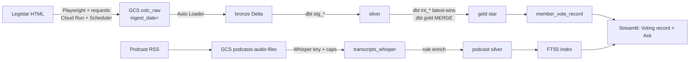

# Making San Francisco's votes queryable

### A legislation lakehouse, a podcast slice, and a text-to-SQL agent

**Team:** Corn Off the Cobb
**Repo:** [github.com/20sgt/Data-Architecture](https://github.com/20sgt/Data-Architecture)


---

## 1. Problem, domain & dataset

San Francisco publishes every bill, committee hearing, and recorded vote on [sfgov.legistar.com](https://sfgov.legistar.com). The record is public. It is not usable as data. There is no complete historical API for this jurisdiction. If you want to know how a supervisor voted on housing this year, or whether a matter passed or died in committee, you click through Legistar one file at a time.

That gap matters to residents, reporters, and civic groups. Local power shows up in roll calls and file numbers, not press releases. It also matters as a data problem: nested votes, statuses that change after a bill is introduced, and two independent slices (legislation and meetings) that only join downstream.

**Who would care.** A neighbor asking "how did my supervisor vote?" A journalist checking a file number. A data-science classmate who needs a source with real volume, a real schema, and real questions.

**What we ingested**

| Slice | Source | Grain | Cadence |
|--------|--------|--------|---------|
| Legislation + meetings | Legistar HTML scrape | One JSON file per matter / meeting | Weekly Cloud Run, plus a 2000–2026 backfill |
| Podcasts (second source) | SF Chronicle / Voice of SF RSS | One MP3 + metadata JSON per episode | Weekly Cloud Run, Sunday 03:00 PT |

Gold holds **587,758 vote rows** and **179,566 actions**, with matters stored as an accumulating snapshot (status and milestone dates update in place). About **58%** of action rows and **3.8%** of vote rows have no meeting — procedural steps that never occurred on a calendar. Podcasts add **~1,860 episodes across 9 shows** in `gs://podcasts-audio-files`.

Business questions we designed for: how did a member vote in a window; what happened to a file; what is still in committee; is there related local audio.

---

## 2. Architecture & data flow

Medallion layout: **bronze** (immutable raw), **silver** (typed flatten), **gold** (star schema + serving view). After bronze, **dbt** owns the transforms. New GCS files land through **Databricks Auto Loader**. The product is Streamlit on `gold.member_vote_record`, with an Ask tab that turns English into SQL.



**Stack.** GCP (Cloud Run, Cloud Scheduler, GCS, Terraform) · Databricks (Unity Catalog `corn_off_the_cob`, SQL warehouse, Asset Bundle) · dbt (staging, intermediate, gold, tests) · Streamlit + Anthropic for Ask · faster-whisper for audio.

**dbt.** Eight `stg_*` models flatten nested bronze JSON. `int_*` keeps the latest scrape per natural key. Gold builds dimensions, facts, bridges, and `member_vote_record`, and `dbt build` runs 49 data tests with it. Production schemas are **opt-in** (`prod_schemas: true`): a laptop `dbt run` writes a developer sandbox; only the weekly Job writes live `silver` / `gold`.

---

## 3. Implementation details & trade-offs

### Batch ELT, not a fake OLTP database

Legistar is the OLTP system, and we do not own it — we only see its website. Building a normalized OLTP copy would mean two schemas and a sync job for an application that never writes. Each scrape writes **one JSON file per record**, partitioned by `ingest_date`, and never mutates old partitions. If gold logic changes, we replay from bronze instead of re-scraping a multi-year history at about 1 request/second.

The weekly scrape is the union of (a) matters **created** in the window and (b) everything on that week's agendas. A matter that changes status *off-agenda* can still go stale. That is an open gap in `TODO.md`, not a solved incremental CDC feed.

### Why Databricks + dbt

Early gold lived in PySpark notebooks. That was a weak team contract: easy to rebuild gold outside tests and grants. dbt now owns everything after bronze. Auto Loader stays a notebook because "only ingest files we have not seen" is not a batch SQL pattern. `databricks.yml` runs `bronze_ingest` → `dbt_build`, emails on failure, and keeps the **dev schedule paused** so a local deploy does not become a live weekly cron by accident.

### Critical trade-off: serving view vs. joining the star every time

**Choice.** Denormalize votes into `gold.member_vote_record`: member, bill, outcome, committee, meeting. Joins are LEFT so a missing meeting never drops a vote. Grain stays one row per vote (same count as `fact_vote`).

**Gained.** Dashboard and text-to-SQL can answer most "how did X vote?" questions with one `SELECT`.

**Gave up.** Every query re-runs a four-way join — a cost we measured rather than guessed (§5). Questions about **sponsors, attachments, or district** do not live on this view. `dim_person` is identity-only; district and party are not on the pages we scrape.

**Why anyway.** The product is a voting record, not a general query language over the whole star.

### Podcast slice

Audio is a **separate bucket and pipeline**. RSS → MP3 + metadata → Whisper into `podcasts/transcripts_whisper/` → rule-based enrich (bills, people, topics, quote windows) → SQLite + GCS JSONL. Weekly Cloud Run uses model **tiny** on CPU with caps: **5 new episodes, 20 minutes, about $0.25, 30-minute job timeout**. We do **not** automatically join spoken nicknames like "Prop C" to Legistar `matter_file` — enrichment is regex and lexicons, not a gold foreign key.

---

## 4. Deep dive: text-to-SQL on gold

**Why this option.** Civic questions are structured. People ask English; the warehouse answers with `vote_value` and `final_disposition`. That is a better fit than training a model on 26 years of HTML.

**What we built** (`app/ask.py`; Streamlit Ask tab):

1. Load the gold schema live from the warehouse (cached), so the prompt cannot drift from dbt — including **sampled values of the 13 controlled-vocabulary columns**.
2. The model returns `{sql, search_terms}` — or an **empty `sql`** for off-topic or instruction-shaped input ("ignore your instructions…"), which short-circuits to a canned refusal: no warehouse query, no podcast search, no second model call.
3. **`guard_sql`:** allow only `SELECT` / `WITH`; checks run on a comment-stripped, literal-masked copy, so quoted data never false-positives; reject multiple statements and DML/DDL; append `LIMIT 200` if missing.
4. Run SQL on the warehouse.
5. Optional BM25 search over ~60-second Whisper chunks (SQLite FTS5; no embedding API).
6. A second model call writes a short answer that must use the result rows — not invented counts.

The planner is told to prefer `corn_off_the_cob.gold.member_vote_record`.

```bash
python app/ask.py "Which supervisor votes 'No' most often?"
```


### Quantitative evaluation

`app/eval.py` grades the planner against **hand-written reference SQL**: both run on the same gold, and the result sets are compared as an order-insensitive multiset of normalized rows — no LLM in the grader. 28 checked-in fixtures: 22 accuracy questions, plus 2 guardrail probes, 2 unanswerable questions, and 2 off-topic/injection probes, each scored separately so a safety check never inflates an accuracy percentage. Guardrails and off-topic declines both hold 2/2.

| run | question set | schema given to the planner | score |
|---|---|---|---|
| 1 | 16 questions, loosely worded | names + types | 11/16 |
| 2 | same 16, output shape specified | names + types | 16/16 |
| 3 | + 6 harder vocabulary questions | names + types | 21/22 |
| 4 | same 22 | + sampled column values | **22/22** |

Run 1 → 2 was a fixture fix, not a model improvement — the five "failures" returned correct answers in a wider shape than the ambiguous questions specified. Run 3 → 4 is the real result: the remaining failure reconstructed `lifecycle` from `LIKE '%pass%'` patterns and missed by 408, because the planner knew column names but not their values. Sampling each small column's distinct values into the prompt took that question from 0/4 to 4/4 on repeated A/B runs.

**The failure that did not move.** Asked which district Connie Chan represents — a column gold does not have — the app answers "District 1" anyway, from the model's own priors, in a paragraph where every other fact is warehouse-derived. The answer is *true*, which is what makes it dangerous: provenance, not accuracy, and no result-set grader can catch it. Full write-up: [`docs/nl_sql_eval.md`](https://github.com/20sgt/Data-Architecture/blob/main/docs/nl_sql_eval.md).

---

## 5. Performance benchmark

**Question.** `member_vote_record` is a **view**. Does materializing it help, and does clustering on `(member_name, vote_date)` help dashboard queries?

**Harness.** `scripts/bench_serving.py`. Three arms, identical rows: **A** the production view, **B** the same rows as an unclustered table, **C** that table with `CLUSTER BY (member_name, vote_date)` + `OPTIMIZE` — B and C built in a dev sandbox, production gold only read. Two query shapes from the dashboard: the overview (counts per member × `vote_value` over its default two-year window) and one median-activity member's drill-down. Result cache off (verified per statement); 2 warmups discarded; **7 timed runs** interleaved across arms; latency measured client-side, bytes and files from `system.query.history`. 0 of 42 executions rejected.

**Results** (medians of 7):

| arm | shape | median ms | exec ms | bytes read | files read |
|---|---|--:|--:|--:|--:|
| A_view | overview | 767 | 361 | 5.2 MB | 6 |
| A_view | drill-down | 956 | 451 | 10.5 MB | 5 |
| B_table | overview | **341** | 89 | 1.8 MB | 1 |
| B_table | drill-down | **535** | 144 | 17.1 MB | 1 |
| C_clustered | overview | 447 | 137 | 1.8 MB | 1 |
| C_clustered | drill-down | 658 | 303 | 33.4 MB | 1 |

**A → B: materializing halves what the user waits for** (767 → 341 ms overview, 956 → 535 ms drill-down) and cuts warehouse execution ~4× — the view re-runs a four-way LEFT JOIN over 587,758 votes on every query, and the table has that join paid down at build time.

**B → C: clustering loses, and the null result is the finding.** The whole table is one 84 MB Delta file. Liquid clustering works by skipping files; with one file there is nothing to skip, so C can only shuffle row order — which broke insertion-order locality and made it *slower*. At ~142 bytes/row, a second 128 MB file needs ~943,000 rows: about **42 years of SF votes**.

Full protocol and raw numbers: [`docs/bench_serving.md`](https://github.com/20sgt/Data-Architecture/blob/main/docs/bench_serving.md).

---

## 6. Visuals, examples & demonstrations

Public repo: [github.com/20sgt/Data-Architecture](https://github.com/20sgt/Data-Architecture)


---

## 7. Reflection

**Hard parts.** Legistar is a website, not an API. A Cloud Run job can exit 0 with an empty `ingest_date=` partition — and during the Board's summer recess that is *correct*, so our first instinct ("alert on zero files") would have cried wolf weekly until September. dbt sandboxing had to key off a **Job var**, not `target.name`, because Databricks generates the job profile. Gold grants went from too broad to too narrow: teammates can read gold but not bronze, so they cannot run this project's staging models.

**Learned.** Immutable bronze is why a long scrape is replayable. A serving view is a product choice: it made text-to-SQL easy and made the view-vs-table benchmark necessary — and the benchmark then said to materialize. Documentation drifts but data does not: the eval's biggest accuracy win came from sampling real column values into the prompt instead of trusting catalog comments that listed a vote value that never occurs.

**Do differently.** Alert on zero files *only when the calendar had meetings that week* — the scraper must know "nothing happened" from "I failed to see it." Materialize `member_vote_record` in dbt (the benchmark's 2× is sitting there). Add a small alias list so podcast enrich can attach `matter_file`. Decide on purpose whether contributors get `SELECT` on bronze.

**Presentation feedback.** *(Fill in after the final: what instructors or peers actually said and what changed because of it.)*
