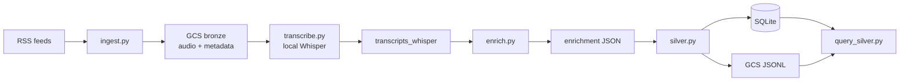

# Architecture — Podcast Pipeline

## Design goals

1. Make civic podcast content **searchable** by bill, representative, and topic.
2. Prefer **local / free** compute for transcription and enrichment (no Speech-to-Text API).
3. Keep bronze immutable; write Whisper transcripts to a **separate** prefix so legacy files stay untouched.
4. Normalize entity IDs (`prop_c`, `scott_wiener`) so queries do not depend on perfect spelling.

## Components

| Script | Responsibility | Runtime |
|--------|----------------|---------|
| `ingest.py` | Fetch RSS, download MP3s, write metadata + manifest | Local or Cloud Run |
| `transcribe.py` | Local `faster-whisper` → `transcripts_whisper/` | **Local only** |
| `enrich.py` | Extract bills / people / topics / stances / claims | Local or Cloud Run |
| `silver.py` | Flatten enrichment → SQLite + GCS JSONL | Local or Cloud Run |
| `query_silver.py` | CLI demos against local SQLite | Local |

## Data flow

## Idempotency

- Ingest skips episode IDs already in `_manifest.json`.
- Transcribe skips if `transcripts_whisper/...json` exists.
- Enrich skips if `enrichment/...json` exists (unless `--force`).
- Silver rebuilds tables from all enrichment files each run.

Re-runs are safe and only process gaps.

## Quality gate

`enrich.py` marks transcripts `usable=false` when text is too short or ASR looks like garbage. Unusable episodes still get an enrichment stub; silver stores `usable=0` so queries can filter them out.

## Normalization for querying

| Raw mention | Stored key |
|-------------|------------|
| Prop C / Proposition C | `prop_c` |
| Assembly Bill 1487 / AB 1487 | `ab_1487` |
| Scott Wiener | `scott_wiener` |
| homelessness keywords | topic `homelessness` |

People lexicon: `sfchronicle_podcast_ingest/data/representatives.json`.

## Weekly operations

**Cloud (ingest + enrich + silver JSONL):** Cloud Run Job + Scheduler (Sunday 3:00 AM PT).  
**Local (Whisper):** `./run_transcribe.sh` when new audio appears, then enrich/silver.

See package [README](../sfchronicle_podcast_ingest/README.md) for deploy commands.

## What we deliberately avoid

- Google Cloud Speech-to-Text
- Paid LLM extraction
- BigQuery (optional later; silver is SQLite + JSONL today)
