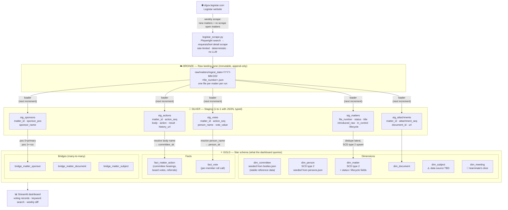
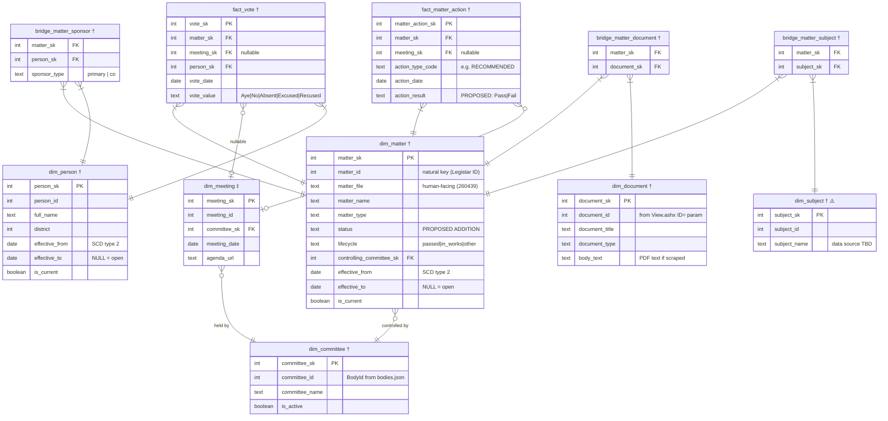

# Architecture Diagrams

Open this file in VS Code's Markdown Preview (`Cmd+Shift+V`) to render the diagrams.
GitHub also renders Mermaid natively.

---

## 1. Pipeline — data flow (Bronze → Silver → Gold)

---

## 2. Star schema — entity-relationship diagram

Tables with a **†** are owned by the legislation slice (Lynn).
Tables with a **‡** are owned by the meeting slice (teammate).
`meeting_sk` on both fact tables is **nullable** — resolved when meeting data is present.

> `dim_matter` and `dim_person` use **SCD type 2**: when something changes (e.g. a bill's
> status or a supervisor's district), the old row is closed (`effective_to`, `is_current=false`)
> and a new row is inserted. Query current state with `WHERE is_current = true`.

